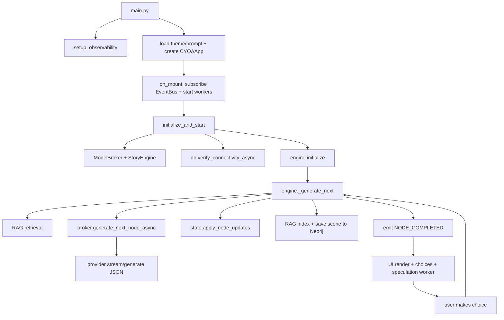

# CYOA TUI CodeWiki

This document is a local developer wiki for the `CYOA_TUI` repository.  
It focuses on architecture, runtime flow, module responsibilities, key data contracts, and extension points.

## 1) Project Snapshot

- App type: terminal UI (`Textual`) for AI-generated choose-your-own-adventure gameplay.
- Language/runtime: Python `>=3.13`.
- Primary entrypoint: `main.py`.
- Core package: `cyoa/`.
- Persistence:
  - Graph persistence and branching history: Neo4j (`cyoa/db/graph_db.py`)
  - Semantic memory: ChromaDB (`cyoa/db/rag_memory.py`)
- LLM backends:
  - `llama-cpp-python` (local GGUF)
  - Ollama HTTP API
  - mock provider for degraded/dev mode
- Observability: OpenTelemetry traces/metrics + optional Jaeger/Prometheus/Grafana stack.

## 2) Repository Map

### Core code

- `main.py`: app bootstrap, arg parsing, theme/prompt resolution, observability init.
- `cyoa/core/`: engine, state, event bus, models, constants, circuit breaker, observability.
- `cyoa/llm/`: prompt/context pipeline, model broker/orchestration, providers.
- `cyoa/ui/`: `Textual` app and mixins (rendering, navigation, persistence, theme, events, typewriter), UI components, styles.
- `cyoa/db/`: Neo4j adapter + RAG memory adapters + story logger.

### Supporting assets

- `themes/*.toml` + `themes/themes.json`: starting prompt themes and mood configuration.
- `cyoa/llm/templates/system_prompt.j2`: system prompt template.
- `loading_art.md`, `cyoa/ui/ascii_art.py`: visual flavor.

### Infra and tooling

- `docker-compose.yml`: Neo4j + observability stack.
- `monitoring/`: OTEL collector, Prometheus, Grafana provisioning.
- `download_model.py`: GGUF model bootstrap utility.

### Tests

- `tests/`: unit/integration-style tests for models, context/broker logic, DB behavior, TUI flows, providers, circuit breaker, streaming interruption, perf sanity.

## 3) Runtime Flow (End-to-End)



## 4) Main Modules and Responsibilities

## 4.1 `cyoa/core`

- `constants.py`
  - Story defaults, UI/typewriter tuning, model defaults, file locations, scene keyword mapping.
- `models.py`
  - Pydantic contracts:
    - `Choice`
    - `StoryNode` (full turn payload)
    - `NarratorNode` (phase 1)
    - `ExtractionNode` (phase 2)
  - Enforces `2..4` choices for non-ending `StoryNode`.
- `events.py`
  - Lightweight global pub/sub bus (`bus`) with named `Events` constants.
- `state.py`
  - Owns mutable game state (turn, node, stats, inventory, scene ID, title, undo snapshot).
  - Emits stat/inventory update events on mutation.
- `engine.py` (`StoryEngine`)
  - Central orchestrator:
    1. retrieves memories
    2. triggers non-blocking background summarization when needed
    3. resolves speculation cache or calls broker
    4. updates state
    5. writes RAG + Neo4j
    6. emits events for UI
  - Also handles retry, undo, save/load data hydration, and branching restore.
- `rag.py` (`RAGManager`)
  - Bridges engine and memory backends; retrieval + indexing + rebuild.
- `circuit_breaker.py`
  - Thread-safe + async-safe circuit breaker used by DB adapter.
- `observability.py`
  - OTEL setup plus helper sessions (`DBObservedSession`, `EngineObservedSession`, `LLMObservedSession`).

## 4.2 `cyoa/llm`

- `pipeline.py`
  - Prompt assembly is composable:
    - `PersonaComponent`
    - `GoalComponent`
    - `DirectiveComponent`
    - `PlayerSheetComponent`
    - `MemoryComponent`
    - `SummarizationComponent`
    - `HistoryComponent`
- `broker.py`
  - `StoryContext`: rolling history, memories, summaries, inventory/stats, token budgeting, pruning.
  - `SpeculationCache`: LRU cache for predicted next node + provider state.
  - `ModelBroker`:
    - chooses provider via env/model path
    - unified mode (`StoryNode` in one call) or judge pattern (narrator + extraction)
    - JSON repair loop
    - partial JSON narrative streaming via `jiter`
    - hierarchical summarization (scene -> chapter -> arc) in background lock
- `providers.py`
  - `LLMProvider` interface:
    - token counting
    - text/json generation
    - streaming
    - optional save/load state
  - Implementations:
    - `LlamaCppProvider`
    - `OllamaProvider`
    - `MockProvider`

## 4.3 `cyoa/db`

- `graph_db.py` (`CYOAGraphDB`)
  - Creates/links story scenes in Neo4j.
  - Retrieves linear history path and full branching tree for UI map.
  - Uses circuit breaker and offline-safe fallbacks.
- `rag_memory.py`
  - `NarrativeMemory`: semantic memory with lazy Chroma init + fallback deque.
  - `NPCMemory`: per-NPC semantic memory collections + fallback buffers.
- `story_logger.py`
  - Event-driven story markdown logger scaffold.

## 4.4 `cyoa/ui`

- `app.py` (`CYOAApp`)
  - Top-level Textual app and widget composition.
  - Subscribes to engine events and starts workers on mount.
  - Owns restart/init/speculation/click/button/choice actions.
- Mixins:
  - `events.py`: event handlers from engine -> UI updates.
  - `rendering.py`: streaming behavior, node render, scene art, choice mounting.
  - `navigation.py`: undo, branch, restart/quit confirms, story map.
  - `persistence.py`: save/load JSON snapshots.
  - `typewriter.py`: queue-driven reveal worker and skip/speed controls.
  - `theme.py`: dark mode, mood class + accent/spinner adaptation.
- `components.py`
  - Modal screens (`ConfirmScreen`, `HelpScreen`, `LoadGameScreen`, `BranchScreen`)
  - `ThemeSpinner`
  - `StatusDisplay`
- `styles.tcss`
  - Layout and mood classes; panel transitions; status/choices visuals.

## 5) Core Data Contracts

## 5.1 `StoryNode` schema (runtime payload)

Expected fields (engine-facing):

- `narrative: str`
- `title: str | None`
- `choices: list[Choice]`
- `is_ending: bool`
- `mood: str`
- `items_gained: list[str]`
- `items_lost: list[str]`
- `npcs_present: list[str]`
- `stat_updates: dict[str, int]`

Validation rule:

- If `is_ending == False`, choice count must be between `2` and `4`.

## 5.2 Save file shape (from `StoryEngine.get_save_data`)

Not strict-schema-enforced, but includes:

- engine context:
  - `version`
  - `starting_prompt`
  - `context_history`
- state snapshot:
  - `story_title`
  - `turn_count`
  - `inventory`
  - `player_stats`
  - `current_node` (serialized `StoryNode`)
  - `current_scene_id`
  - `last_choice_text`
- UI adds:
  - `current_story_text`

## 6) Event-Driven Contracts

`StoryEngine` emits:

- lifecycle: `ENGINE_STARTED`, `ENGINE_RESTARTED`
- generation: `NODE_GENERATING`, `TOKEN_STREAMED`, `NODE_COMPLETED`, `SUMMARIZATION_STARTED`
- state: `STATS_UPDATED`, `INVENTORY_UPDATED`, `STORY_TITLE_GENERATED`
- outcomes: `ENDING_REACHED`, `ERROR_OCCURRED`, `STATUS_MESSAGE`

`CYOAApp` subscribes in `on_mount` and translates these into:

- spinner/status notifications
- markdown narrative updates
- stats/inventory widget updates
- story map refresh

## 7) Configuration and Runtime Knobs

Key env variables used across modules:

- LLM selection:
  - `LLM_PROVIDER` = `llama_cpp | ollama | mock`
  - `LLM_MODEL_PATH`
  - `LLM_MODEL` (ollama model id)
  - `OLLAMA_BASE_URL`
- generation behavior:
  - `LLM_UNIFIED_MODE` (default true)
  - `LLM_N_CTX`
  - `LLM_TEMPERATURE`
  - `LLM_MAX_TOKENS`
  - `LLM_TOKEN_BUDGET`
  - `LLM_SUMMARY_THRESHOLD`
  - `LLM_SUMMARY_MAX_TOKENS`
  - `LLM_REPAIR_ATTEMPTS`
- persistence:
  - `NEO4J_URI`, `NEO4J_USER`, `NEO4J_PASSWORD`
- observability:
  - `OTEL_EXPORTER_OTLP_ENDPOINT`
  - `GRAFANA_PASSWORD` (compose)

Local runtime files:

- `.config.json`: UI prefs (dark mode, typewriter settings)
- `saves/*.json`: save slots
- `story.md`: logger target

## 8) Test Coverage Map

- `tests/test_models.py`: Pydantic model validation rules.
- `tests/test_story.py`: large coverage of context pruning/summaries, broker repair/fallback, engine non-blocking summarization, memory, branching restore, streaming extraction.
- `tests/test_tui.py`: high-level Textual behavior (startup, choices, restart, dialogs, undo, save/load).
- `tests/test_llm_providers.py`: provider integration behavior with mocks.
- `tests/test_speculative_interruption.py`: cancellation/logits interruption path.
- `tests/test_db_integration.py`: Neo4j query/creation behavior with mocked driver.
- `tests/test_circuit_breaker.py`: sync/async failure and reset behavior.
- `tests/test_themes.py`: theme file contract.
- `tests/test_perf.py`: typewriter queue population sanity.

## 9) Extension Guide

## 9.1 Add a new theme

1. Create `themes/<name>.toml` with required keys (`name`, `description`, `prompt`, `spinner_frames`, `accent_color`).
2. Optionally map moods in `themes/themes.json`.
3. Verify with `tests/test_themes.py`.

## 9.2 Add a new LLM provider

1. Implement `LLMProvider` in `cyoa/llm/providers.py`.
2. Add resolver branch in `ModelBroker._create_provider_from_env`.
3. Ensure token counting and streaming semantics are consistent.
4. Add provider tests in `tests/test_llm_providers.py`.

## 9.3 Add new player stats

1. Add default in `GameState._DEFAULT_STATS`.
2. Ensure prompt injection (`PlayerSheetComponent`) includes it.
3. Update UI rendering in `StatusDisplay` if needed.
4. Extend tests for state mutation and render behavior.

## 9.4 Add engine/UI events

1. Define constant in `Events`.
2. Emit from engine/state path.
3. Subscribe/handle in `CYOAApp` or mixin.
4. Add tests to avoid silent regressions.

## 10) Known Caveats (Current State)

- `StoryLogger` subscribes to legacy event names (`"story_started"`, `"choice_made"`, `"scene_generated"`), while the engine emits namespaced constants (for example `engine.choice_made`). As-is, logger callbacks are not aligned with current event emissions.
- `main.py` currently hard-requires `--model` or `LLM_MODEL_PATH`, even when `LLM_PROVIDER=ollama` could run without a local GGUF path.
- The repository contains a very large GGUF artifact at project root; this affects repo size and local operations.

## 11) Quick Developer Commands

```bash
uv sync
docker-compose up -d
uv run python main.py --theme dark_dungeon
```

Quality checks:

```bash
uv run pytest
uv run ruff check .
uv run mypy .
```

