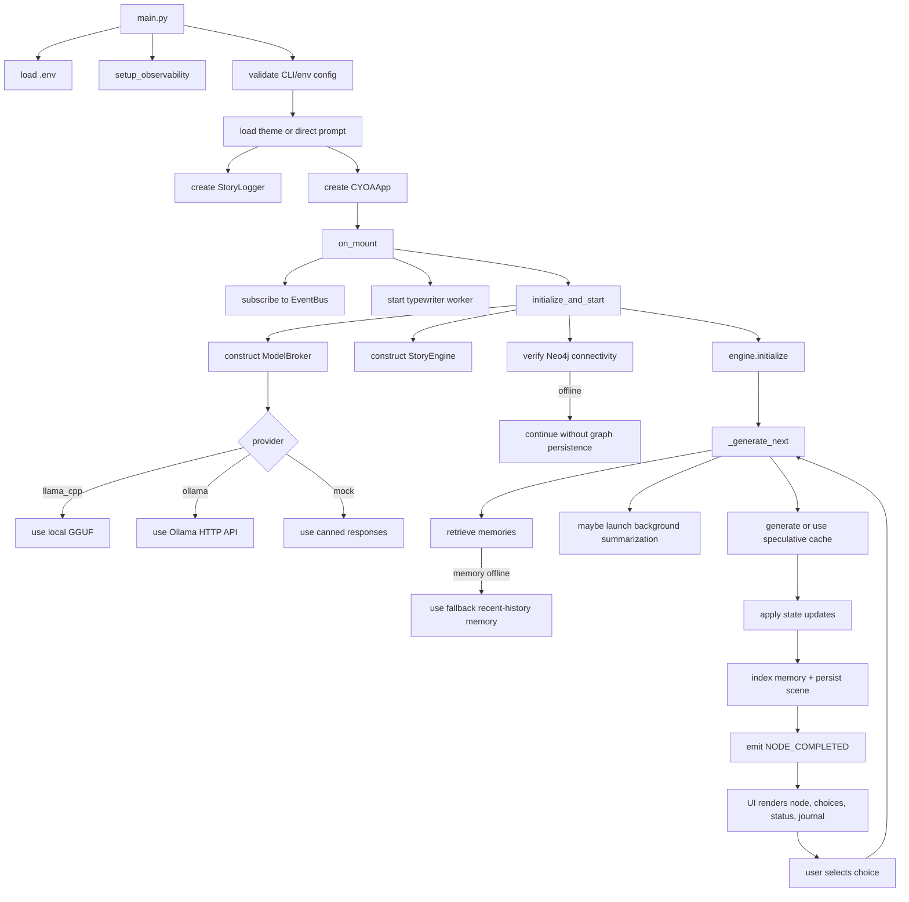

# CYOA TUI CodeWiki

This document reflects the repository as it exists now.
It is a developer-facing status wiki, not an aspirational design doc.

## 1) Project Snapshot

- App type: terminal choose-your-own-adventure game built with `Textual`.
- Language/runtime: Python `>=3.13`.
- Entrypoint: `main.py`.
- Core package: `cyoa/`.
- Story generation backends:
  - `llama-cpp-python`
  - Ollama HTTP API
  - `MockProvider` for explicit test/dev runs
- Persistence and memory:
  - Neo4j graph persistence in [`cyoa/db/graph_db.py`](/Users/kishan/CYOA_TUI/cyoa/db/graph_db.py)
  - Chroma-backed narrative/NPC memory with in-memory fallback in [`cyoa/db/rag_memory.py`](/Users/kishan/CYOA_TUI/cyoa/db/rag_memory.py)
- Observability: OpenTelemetry spans and metrics in [`cyoa/core/observability.py`](/Users/kishan/CYOA_TUI/cyoa/core/observability.py)

## 2) Current Repository Map

### Runtime entry and config

- [`main.py`](/Users/kishan/CYOA_TUI/main.py)
  - loads `.env` early
  - validates startup config
  - resolves theme or direct `--prompt`
  - initializes observability
  - instantiates `StoryLogger` and `CYOAApp`

### Core engine

- [`cyoa/core/constants.py`](/Users/kishan/CYOA_TUI/cyoa/core/constants.py): default prompt, UI constants, save/log file locations, LLM defaults.
- [`cyoa/core/models.py`](/Users/kishan/CYOA_TUI/cyoa/core/models.py): `Choice`, `StoryNode`, `NarratorNode`, `ExtractionNode`.
- [`cyoa/core/events.py`](/Users/kishan/CYOA_TUI/cyoa/core/events.py): global event bus plus namespaced event constants.
- [`cyoa/core/state.py`](/Users/kishan/CYOA_TUI/cyoa/core/state.py): mutable game state, save/load serialization, one-level undo.
- [`cyoa/core/engine.py`](/Users/kishan/CYOA_TUI/cyoa/core/engine.py): orchestration for generation, persistence, restore, retry, branching.
- [`cyoa/core/rag.py`](/Users/kishan/CYOA_TUI/cyoa/core/rag.py): bridge between engine and memory backends.
- [`cyoa/core/circuit_breaker.py`](/Users/kishan/CYOA_TUI/cyoa/core/circuit_breaker.py): DB availability guard.
- [`cyoa/core/theme_loader.py`](/Users/kishan/CYOA_TUI/cyoa/core/theme_loader.py): loads theme TOML plus mood config from `themes.json`.

### LLM layer

- [`cyoa/llm/broker.py`](/Users/kishan/CYOA_TUI/cyoa/llm/broker.py)
  - `StoryContext`
  - `SpeculationCache`
  - `ModelBroker`
- [`cyoa/llm/pipeline.py`](/Users/kishan/CYOA_TUI/cyoa/llm/pipeline.py): prompt component pipeline.
- [`cyoa/llm/providers.py`](/Users/kishan/CYOA_TUI/cyoa/llm/providers.py): provider interface plus `LlamaCppProvider`, `OllamaProvider`, `MockProvider`.
- [`cyoa/llm/templates/system_prompt.j2`](/Users/kishan/CYOA_TUI/cyoa/llm/templates/system_prompt.j2): system prompt template.

### UI layer

- [`cyoa/ui/app.py`](/Users/kishan/CYOA_TUI/cyoa/ui/app.py): top-level `Textual` app, workers, event subscriptions, speculation.
- Mixins under [`cyoa/ui/mixins/`](/Users/kishan/CYOA_TUI/cyoa/ui/mixins):
  - `events.py`
  - `rendering.py`
  - `navigation.py`
  - `persistence.py`
  - `theme.py`
  - `typewriter.py`
- [`cyoa/ui/components.py`](/Users/kishan/CYOA_TUI/cyoa/ui/components.py): modal screens, spinner, reactive status bar, journal/tree item types.
- [`cyoa/ui/styles.tcss`](/Users/kishan/CYOA_TUI/cyoa/ui/styles.tcss): layout and visual styling.
- [`cyoa/ui/ascii_art.py`](/Users/kishan/CYOA_TUI/cyoa/ui/ascii_art.py): per-scene ASCII art library.

### Data and infra

- [`themes/`](/Users/kishan/CYOA_TUI/themes): theme prompts, accents, spinner frames, mood mapping.
- [`monitoring/`](/Users/kishan/CYOA_TUI/monitoring): OTEL collector, Prometheus, Grafana provisioning.
- [`docker-compose.yml`](/Users/kishan/CYOA_TUI/docker-compose.yml): Neo4j + observability stack.
- [`download_model.py`](/Users/kishan/CYOA_TUI/download_model.py): local model bootstrap helper.

### Tests

- [`tests/`](/Users/kishan/CYOA_TUI/tests): core, UI, provider, DB, observability, performance, and regression coverage.

## 3) Runtime Flow



## 4) What Is Actually Implemented

### 4.1 Startup and configuration

- `main.py` now performs explicit validation before the UI starts.
- `LLM_PROVIDER` must be one of `llama_cpp`, `ollama`, or `mock`.
- Numeric env vars such as `LLM_N_CTX`, `LLM_MAX_TOKENS`, and `LLM_TOKEN_BUDGET` are rejected early if malformed.
- `llama_cpp` requires a model path.
- `ollama` and `mock` do not require a local GGUF path.
- `--prompt` overrides `--theme`.
- Theme loading comes from `themes/<name>.toml`; available themes are shown in parser help.

### 4.2 Engine behavior

`StoryEngine` is the central coordinator.

Implemented responsibilities:

- initialize a fresh `StoryContext`
- reset `GameState`
- retrieve RAG memories before generation
- trigger summarization in a background task when token usage crosses threshold
- use speculative cache when a predicted node exists
- call `ModelBroker.generate_next_node_async` otherwise
- save provider state into `SpeculationCache` when available
- apply stat/inventory changes through `GameState`
- create the story title on first turn
- index generated narrative into memory
- persist scene data to Neo4j when DB is online
- emit events for UI refresh and endings
- support retry, one-level undo, save/load, and branch restore

### 4.3 Story context and prompt assembly

`StoryContext` currently stores:

- opening prompt in `history[0]`
- alternating assistant/user turn history
- inventory and player stats
- retrieved memories
- three hierarchical summaries:
  - `scene_summary`
  - `chapter_summary`
  - `arc_summary`
- optional goals/directives

Prompt assembly is component-based via `PromptPipeline`. The final message stack comes from `StoryContext.get_messages()`.

### 4.4 Generation modes

`ModelBroker` supports two modes:

- Unified mode:
  - one JSON generation pass into full `StoryNode`
  - optional streaming of partial narrative extracted from partial JSON via `jiter`
- Judge pattern:
  - narrator pass into `NarratorNode`
  - extraction pass into `ExtractionNode`
  - merged into final `StoryNode`

Selection is controlled by `LLM_UNIFIED_MODE` and defaults to unified mode.

### 4.5 Provider behavior

- `LlamaCppProvider`
  - uses local GGUF via `llama_cpp.Llama`
  - supports token counting, JSON streaming, and provider state save/load
  - uses a cancellable logits processor for interruption
- `OllamaProvider`
  - uses `httpx` against `/api/chat`
  - supports plain text, JSON, and JSON streaming
  - token counting uses `tiktoken` if present, otherwise rough estimate
- `MockProvider`
  - returns canned narrative/JSON
  - used directly for tests/dev when `LLM_PROVIDER=mock`

### 4.6 UI behavior

The UI is a `Textual` app composed from mixins. Current user-facing features include:

- streaming narrative render with optional typewriter effect
- skip current narration with `space`
- typewriter speed cycling with `v`
- dark/light toggle with `d`
- journal side panel
- story map side panel
- branch selection from a past scene
- one-level undo
- save/load JSON snapshots
- restart and quit confirmation modals
- reactive stats/inventory status bar
- mood-driven styling plus scene ASCII art
- background speculation for the first available choice only

### 4.7 Persistence and degraded operation

Neo4j:

- `CYOAGraphDB.verify_connectivity_async()` disables graph persistence if connection fails.
- All graph write/read paths are wrapped with a circuit breaker and safe fallbacks.
- When offline, the game continues with in-memory state and generated UUID scene IDs.

RAG / Chroma:

- `NarrativeMemory` and `NPCMemory` lazy-initialize Chroma collections.
- On failure or missing dependency, they degrade to recent-history fallback buffers.
- Retry/backoff logic avoids repeated blocking failures.

## 5) Core Data Contracts

### 5.1 `StoryNode`

Runtime fields:

- `narrative: str`
- `title: str | None`
- `items_gained: list[str]`
- `items_lost: list[str]`
- `npcs_present: list[str]`
- `stat_updates: dict[str, int]`
- `choices: list[Choice]`
- `is_ending: bool`
- `mood: str`

Validation rule:

- non-ending nodes must have between `2` and `4` choices
- ending nodes may have `0` choices

### 5.2 Save-file shape

Engine-level save data from `StoryEngine.get_save_data()` includes:

- `version`
- `starting_prompt`
- `context_history`
- `story_title`
- `turn_count`
- `inventory`
- `player_stats`
- `current_node`
- `current_scene_id`
- `last_choice_text`

UI save/load adds:

- `current_story_text`

Save files live under `saves/`.

### 5.3 Neo4j scene payload

When online, scene writes include:

- `narrative`
- `available_choices`
- `story_title`
- `player_stats`
- `inventory`
- `mood`
- link to source scene through a `LEADS_TO` edge when applicable

## 6) Event Contracts

Engine and state emit namespaced events through the global `bus`.

Defined events:

- lifecycle:
  - `engine.started`
  - `engine.restarted`
- narrative flow:
  - `engine.choice_made`
  - `engine.node_generating`
  - `engine.token_streamed`
  - `engine.summarization_started`
  - `engine.node_completed`
- state:
  - `engine.stats_updated`
  - `engine.inventory_updated`
  - `engine.story_title_generated`
- outcomes:
  - `engine.ending_reached`
  - `engine.error_occurred`
  - `engine.status_message`

`CYOAApp.on_mount()` subscribes to these and updates the UI.

Current payload contracts used by subscribers:

- `engine.started`
  - no payload
- `engine.restarted`
  - no payload
- `engine.choice_made`
  - `choice_text: str`
- `engine.node_generating`
  - no payload
- `engine.token_streamed`
  - `token: str`
- `engine.summarization_started`
  - no payload
- `engine.node_completed`
  - `node: StoryNode`
- `engine.stats_updated`
  - `stats: dict[str, int]`
- `engine.inventory_updated`
  - `inventory: list[str]`
- `engine.story_title_generated`
  - `title: str | None`
- `engine.ending_reached`
  - `node: StoryNode`
- `engine.error_occurred`
  - `error: str`
- `engine.status_message`
  - `message: str`

## 7) Configuration Surface

### 7.1 LLM selection

- `LLM_PROVIDER`
- `LLM_MODEL_PATH`
- `LLM_MODEL`
- `OLLAMA_BASE_URL`

### 7.2 Generation and context

- `LLM_UNIFIED_MODE`
- `LLM_N_CTX`
- `LLM_TEMPERATURE`
- `LLM_MAX_TOKENS`
- `LLM_TOKEN_BUDGET`
- `LLM_SUMMARY_THRESHOLD`
- `LLM_SUMMARY_MAX_TOKENS`
- `LLM_REPAIR_ATTEMPTS`

### 7.3 Persistence and telemetry

- `NEO4J_URI`
- `NEO4J_USER`
- `NEO4J_PASSWORD`
- `OTEL_EXPORTER_OTLP_ENDPOINT`

### 7.4 Local runtime files

- `.config.json`: UI preferences
- `saves/*.json`: save files
- `story.md`: story log target

## 8) Test Coverage Map

High-signal tests currently present:

- [`tests/test_main.py`](/Users/kishan/CYOA_TUI/tests/test_main.py): startup config validation and main lifecycle.
- [`tests/test_story_logger.py`](/Users/kishan/CYOA_TUI/tests/test_story_logger.py): event-to-transcript wiring for `story.md`.
- [`tests/test_story.py`](/Users/kishan/CYOA_TUI/tests/test_story.py): story context, summarization, repair loop, fallback generation.
- [`tests/test_engine_state.py`](/Users/kishan/CYOA_TUI/tests/test_engine_state.py): retry, cache hits, persistence hooks, save/load, branching, event emission.
- [`tests/test_tui.py`](/Users/kishan/CYOA_TUI/tests/test_tui.py): Textual startup, choices, panels, inventory/stats behavior.
- [`tests/test_llm_providers.py`](/Users/kishan/CYOA_TUI/tests/test_llm_providers.py): provider JSON/text/stream behavior and provider selection.
- [`tests/test_db_integration.py`](/Users/kishan/CYOA_TUI/tests/test_db_integration.py): graph write/read behavior, cycle pruning, schema statements.
- [`tests/test_observability.py`](/Users/kishan/CYOA_TUI/tests/test_observability.py): metrics/span helper behavior.
- Additional targeted coverage:
  - `test_circuit_breaker.py`
  - `test_speculative_interruption.py`
  - `test_themes.py`
  - `test_perf.py`
  - `test_broker_cache.py`
  - `test_debug.py`

## 9) Operational Caveats

- `story.md` is event-driven. It is refreshed from `Events.STORY_TITLE_GENERATED`, `Events.CHOICE_MADE`, and `Events.NODE_COMPLETED`, so it should now track the live transcript rather than acting as a dormant placeholder.

- `themes/themes.json` is used for mood-to-style mapping, but starting prompt/theme selection comes from individual TOML theme files.

- `ModelBroker._create_provider_from_env()` no longer silently falls back to `MockProvider` for `LLM_PROVIDER=llama_cpp`. A missing local model path is now treated as a configuration error.

- Neo4j and Chroma are both optional at runtime. The app is designed to keep running in degraded mode, so “feature available in code” does not always mean “feature active in this session.”

## 10) Extension Notes

### Add a theme

1. Add `themes/<name>.toml`.
2. Include prompt, spinner frames, and optional accent color.
3. Update `themes/themes.json` if the new mood should affect runtime styling.
4. Run `tests/test_themes.py`.

### Add an LLM provider

1. Implement `LLMProvider` in [`cyoa/llm/providers.py`](/Users/kishan/CYOA_TUI/cyoa/llm/providers.py).
2. Add provider selection logic in `ModelBroker._create_provider_from_env()`.
3. Match the existing text, JSON, and streaming contract.
4. Add coverage in `tests/test_llm_providers.py`.

### Add player stats

1. Extend `GameState._DEFAULT_STATS`.
2. Ensure prompt rendering includes the stat.
3. Update `StatusDisplay` and any delta notifications.
4. Extend state and UI tests.

### Add events

1. Define the constant in `Events`.
2. Emit it from engine/state/UI code.
3. Subscribe in the relevant mixin or service.
4. Add regression tests so silent breakage is visible.

## 11) Developer Commands

```bash
uv sync
docker-compose up -d
uv run python main.py --theme dark_dungeon
```

Quality checks used by the repo:

```bash
uv run pytest -q
uv run ruff check .
uv run mypy cyoa
```
