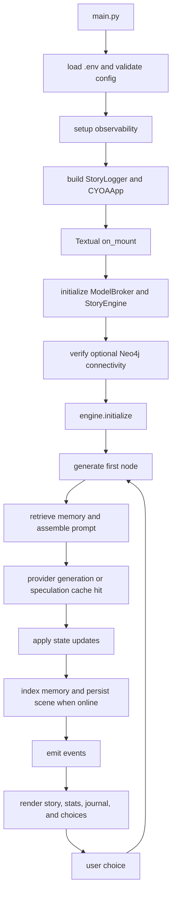

# CYOA TUI CodeWiki

This document describes the repository as it exists on April 18, 2026. It is intended as a fast technical map for contributors, reviewers, and anyone evaluating the project architecture.

## 1. Project Snapshot

- App type: terminal interactive fiction built with `Textual`
- Runtime: Python `>=3.13`
- Entrypoint: [`main.py`](/Users/kishan/CYOA_TUI/main.py)
- Core package: [`cyoa/`](/Users/kishan/CYOA_TUI/cyoa)
- LLM backends:
  - `llama_cpp` for local GGUF models
  - `ollama` for daemon-backed models
  - `mock` for tests and demo-friendly local runs
- Optional integrations:
  - Neo4j graph persistence in [`cyoa/db/graph_db.py`](/Users/kishan/CYOA_TUI/cyoa/db/graph_db.py)
  - Chroma-backed memory in [`cyoa/db/rag_memory.py`](/Users/kishan/CYOA_TUI/cyoa/db/rag_memory.py)
  - OpenTelemetry metrics and traces in [`cyoa/core/observability.py`](/Users/kishan/CYOA_TUI/cyoa/core/observability.py)

## 2. User-Facing Capabilities

The current runtime supports:

- streaming story generation and branching choices
- keyboard-first navigation with number keys, arrows, and `enter`
- save/load, undo/redo, bookmarks, and rewind-based branching
- story export to Markdown and JSON
- journal panel, story map panel, and typewriter controls
- generation preset cycling and live directive editing
- optional theme-driven opening prompts, mood styling, and ASCII scene art
- optional observability and graph persistence without making them mandatory for startup

## 3. Repository Map

### Startup

- [`main.py`](/Users/kishan/CYOA_TUI/main.py)
  - loads `.env`
  - parses `--model`, `--theme`, `--prompt`, `--preset`, and `--runtime-preset`
  - validates provider and numeric env settings
  - initializes observability
  - creates `StoryLogger`
  - starts `CYOAApp`

### Core runtime

- [`cyoa/core/constants.py`](/Users/kishan/CYOA_TUI/cyoa/core/constants.py): defaults, filesystem paths, loading art
- [`cyoa/core/models.py`](/Users/kishan/CYOA_TUI/cyoa/core/models.py): typed story payloads such as `Choice` and `StoryNode`
- [`cyoa/core/state.py`](/Users/kishan/CYOA_TUI/cyoa/core/state.py): game state, undo/redo, bookmarks, serialization
- [`cyoa/core/engine.py`](/Users/kishan/CYOA_TUI/cyoa/core/engine.py): turn orchestration, retries, persistence hooks, branching
- [`cyoa/core/rag.py`](/Users/kishan/CYOA_TUI/cyoa/core/rag.py): retrieval-facing memory coordinator
- [`cyoa/core/events.py`](/Users/kishan/CYOA_TUI/cyoa/core/events.py): event bus contract
- [`cyoa/core/circuit_breaker.py`](/Users/kishan/CYOA_TUI/cyoa/core/circuit_breaker.py): DB isolation and degraded-mode handling
- [`cyoa/core/theme_loader.py`](/Users/kishan/CYOA_TUI/cyoa/core/theme_loader.py): theme discovery and validation
- [`cyoa/core/observability.py`](/Users/kishan/CYOA_TUI/cyoa/core/observability.py): metrics/tracing setup and observed sessions

### LLM layer

- [`cyoa/llm/broker.py`](/Users/kishan/CYOA_TUI/cyoa/llm/broker.py): `StoryContext`, speculation cache, provider-agnostic generation broker
- [`cyoa/llm/providers.py`](/Users/kishan/CYOA_TUI/cyoa/llm/providers.py): concrete providers for `llama_cpp`, `ollama`, and `mock`
- [`cyoa/llm/pipeline.py`](/Users/kishan/CYOA_TUI/cyoa/llm/pipeline.py): prompt assembly pipeline
- [`cyoa/llm/templates/system_prompt.j2`](/Users/kishan/CYOA_TUI/cyoa/llm/templates/system_prompt.j2): base prompt template

### UI layer

- [`cyoa/ui/app.py`](/Users/kishan/CYOA_TUI/cyoa/ui/app.py): top-level Textual app and command bindings
- [`cyoa/ui/components.py`](/Users/kishan/CYOA_TUI/cyoa/ui/components.py): status bar, modals, spinners, helper screens
- [`cyoa/ui/styles.tcss`](/Users/kishan/CYOA_TUI/cyoa/ui/styles.tcss): UI styling
- [`cyoa/ui/ascii_art.py`](/Users/kishan/CYOA_TUI/cyoa/ui/ascii_art.py): mood/scene art lookup
- [`cyoa/ui/mixins/`](/Users/kishan/CYOA_TUI/cyoa/ui/mixins): persistence, navigation, rendering, typewriter, theme, event handling

### Tooling and runtime assets

- [`themes/`](/Users/kishan/CYOA_TUI/themes): shipped themes and mood configuration
- [`monitoring/`](/Users/kishan/CYOA_TUI/monitoring): OpenTelemetry collector, Prometheus, Grafana config
- [`docker-compose.yml`](/Users/kishan/CYOA_TUI/docker-compose.yml): local observability and Neo4j stack
- [`scripts/run_smoke.sh`](/Users/kishan/CYOA_TUI/scripts/run_smoke.sh): smoke suite entrypoint
- [`scripts/check_coverage.py`](/Users/kishan/CYOA_TUI/scripts/check_coverage.py): package-level coverage floor enforcement

## 4. Runtime Flow



## 5. Startup and Configuration

`main.py` is intentionally strict. It fails early when startup configuration is invalid instead of quietly degrading into an unexpected runtime mode.

Current startup behavior:

- valid providers are `llama_cpp`, `ollama`, and `mock`
- `llama_cpp` requires an existing local model path
- `LLM_N_CTX`, `LLM_MAX_TOKENS`, and `LLM_TOKEN_BUDGET` must be positive integers
- `LLM_TEMPERATURE` must be a non-negative float
- `--prompt` overrides the theme prompt
- `--preset` applies a named generation preset
- `--runtime-preset` applies an opinionated profile that can choose provider and preset together

Runtime presets currently defined in [`main.py`](/Users/kishan/CYOA_TUI/main.py):

- `local-quality`
- `local-fast`
- `ollama-dev`
- `mock-smoke`

## 6. Engine Behavior

`StoryEngine` is the coordination layer for the playable loop. It currently:

- initializes and resets `GameState`
- manages `StoryContext` history, goals, and directives
- retrieves memory before generation
- launches summarization when context thresholds are crossed
- uses speculation cache entries when available
- delegates actual model work to `ModelBroker`
- applies stat, inventory, and world-state updates from generated nodes
- records titles, scene ids, and timeline metadata
- persists scenes to Neo4j when available
- supports retry, undo/redo, bookmark restore, save/load, and branch restore

## 7. UI Behavior

The Textual layer is not just a thin shell. It owns interaction patterns, modal flows, and rendering behavior.

Current UI-visible features:

- story streaming with typewriter animation
- choice selection by `1-4`, arrows, or `enter`
- journal and story map side panels
- help modal and restart/quit confirmation flows
- bookmark creation and restore
- story export to `saves/exports/`
- runtime diagnostics in the status bar:
  - provider
  - runtime preset
  - generation preset
  - engine phase
- editable player directives shown in the status panel
- theme-specific loading spinner frames and accent colors

## 8. Persistence and Degraded Mode

Neo4j behavior:

- connectivity is verified asynchronously at startup
- failures disable graph persistence rather than aborting the session
- a circuit breaker protects repeated failing operations

Chroma behavior:

- Chroma runs in-process and is not started by `docker-compose`
- memory initialization is lazy
- recent-history fallback remains available when Chroma is offline
- retries and re-probing are used instead of assuming a permanently healthy memory layer

Export behavior:

- story exports are written locally as Markdown and JSON
- exports are not uploaded anywhere automatically

## 9. Core Data Contracts

### `StoryNode`

Key runtime fields include:

- `narrative: str`
- `title: str | None`
- `items_gained: list[str]`
- `items_lost: list[str]`
- `stat_updates: dict[str, int]`
- `choices: list[Choice]`
- `is_ending: bool`
- `mood: str`

Validation rule:

- non-ending nodes must have `2` to `4` choices
- ending nodes may have `0` choices

### `GameState`

Default player stats in [`cyoa/core/state.py`](/Users/kishan/CYOA_TUI/cyoa/core/state.py):

- `health: 100`
- `gold: 0`
- `reputation: 0`

State serialization includes:

- story metadata and current node
- inventory and player stats
- objectives, faction reputation, NPC affinity, and story flags
- timeline metadata
- undo/redo stacks
- bookmarks

## 10. Event Contracts

Key events defined in [`cyoa/core/events.py`](/Users/kishan/CYOA_TUI/cyoa/core/events.py) include:

- lifecycle:
  - `engine.started`
  - `engine.restarted`
- narrative flow:
  - `engine.choice_made`
  - `engine.node_generating`
  - `engine.token_streamed`
  - `engine.summarization_started`
  - `engine.node_completed`
- state:
  - `engine.stats_updated`
  - `engine.inventory_updated`
  - `engine.story_title_generated`
- outcomes:
  - `engine.ending_reached`
  - `engine.error_occurred`
  - `engine.status_message`
- integrations:
  - `db.saved`
  - `memory.indexed`

Common payloads used by subscribers:

- `engine.choice_made`: `choice_text: str`
- `engine.token_streamed`: `token: str`
- `engine.node_completed`: `node: StoryNode`
- `engine.stats_updated`: `stats: dict[str, int]`
- `engine.inventory_updated`: `inventory: list[str]`
- `engine.story_title_generated`: `title: str | None`
- `engine.error_occurred`: `error: str`
- `engine.status_message`: `message: str`

## 11. Configuration Surface

### Provider selection

- `LLM_PROVIDER`
- `LLM_MODEL_PATH`
- `LLM_MODEL`
- `OLLAMA_BASE_URL`

### Generation and context

- `LLM_UNIFIED_MODE`
- `LLM_N_CTX`
- `LLM_TEMPERATURE`
- `LLM_MAX_TOKENS`
- `LLM_TOKEN_BUDGET`
- `LLM_SUMMARY_THRESHOLD`
- `LLM_SUMMARY_MAX_TOKENS`
- `LLM_REPAIR_ATTEMPTS`
- `LLM_PRESET`
- `APP_RUNTIME_PRESET`

### Persistence and telemetry

- `NEO4J_URI`
- `NEO4J_USER`
- `NEO4J_PASSWORD`
- `OTEL_EXPORTER_OTLP_ENDPOINT`
- `GRAFANA_PASSWORD`

### Local runtime files

- `.config.json`: UI preferences
- `saves/*.json`: save files
- `saves/exports/*`: Markdown and JSON story exports
- `story.md`: story transcript log

## 12. Test and Quality Snapshot

Latest verified local results in this workspace on `2026-04-18`:

- full test suite: `296 passed`
- total coverage in `coverage.json`: `89.46%`
- enforced package coverage floors:
  - `cyoa/core`: `94.41%` against `83.00%`
  - `cyoa/llm`: `94.38%` against `78.00%`
  - `cyoa/db`: `94.09%` against `72.00%`
  - `cyoa/ui`: `89.69%` against `85.00%`

High-signal test modules:

- [`tests/test_main.py`](/Users/kishan/CYOA_TUI/tests/test_main.py): startup validation and main lifecycle
- [`tests/test_engine_state.py`](/Users/kishan/CYOA_TUI/tests/test_engine_state.py): engine state flow, persistence hooks, branching
- [`tests/test_tui.py`](/Users/kishan/CYOA_TUI/tests/test_tui.py): Textual interaction coverage
- [`tests/test_llm_providers.py`](/Users/kishan/CYOA_TUI/tests/test_llm_providers.py): provider behavior and selection
- [`tests/test_observability.py`](/Users/kishan/CYOA_TUI/tests/test_observability.py): tracing and metrics
- [`tests/test_db_integration.py`](/Users/kishan/CYOA_TUI/tests/test_db_integration.py): graph persistence and schema behavior
- [`tests/test_themes.py`](/Users/kishan/CYOA_TUI/tests/test_themes.py): theme validation

## 13. Operational Caveats

- `docker-compose.yml` does not start Chroma because memory is embedded in-process.
- `scripts/run_smoke.sh` only runs the smoke subset, not the entire suite.
- `mock` mode is the easiest showcase path, but it does not represent real provider latency or model quality.
- feature presence in the repo does not imply that optional services are active in a given session

## 14. Extension Notes

### Add a theme

1. Add `themes/<name>.toml`.
2. Include a prompt, spinner frames, and optional accent color.
3. Update `themes/themes.json` when mood styling needs to change.
4. Run `uv run python scripts/validate_themes.py` and `uv run pytest -q tests/test_themes.py`.

### Add a provider

1. Implement `LLMProvider` in [`cyoa/llm/providers.py`](/Users/kishan/CYOA_TUI/cyoa/llm/providers.py).
2. Extend provider selection in `ModelBroker`.
3. Match text, JSON, and streaming behavior.
4. Add regression coverage in `tests/test_llm_providers.py`.

### Add a player stat

1. Extend `GameState._DEFAULT_STATS`.
2. Ensure prompt assembly and status rendering include the new stat.
3. Update engine/UI serialization paths.
4. Add tests that cover save/load and UI display.

### Add an event

1. Define it in `Events`.
2. Emit it from engine, state, or UI code.
3. Subscribe where needed.
4. Add regression coverage.

## 15. Developer Commands

```bash
uv sync --group dev
bash scripts/run_smoke.sh
uv run pytest --cov=cyoa --cov-report=term-missing --cov-report=xml --cov-report=json -q
uv run python scripts/check_coverage.py
uv run ruff check .
uv run mypy cyoa
```

Useful local runs:

```bash
LLM_PROVIDER=mock uv run python main.py --runtime-preset mock-smoke
uv run python main.py --theme dark_dungeon
docker-compose up -d
```
