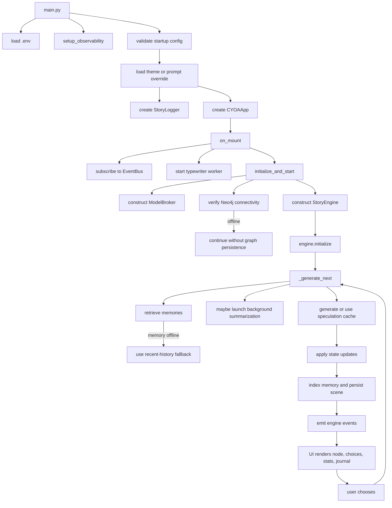

# CYOA TUI CodeWiki

This wiki describes the repository as it exists now, not the intended end state.

## 1. Project Snapshot

- App type: terminal interactive fiction built on `Textual`
- Runtime: Python `>=3.13`
- Entrypoint: [`main.py`](/Users/kishan/CYOA_TUI/main.py)
- Core package: [`cyoa/`](/Users/kishan/CYOA_TUI/cyoa)
- Supported backends:
  - `llama_cpp` via local GGUF
  - `ollama` via HTTP
  - `mock` for tests and development
- Persistence:
  - Neo4j graph persistence in [`cyoa/db/graph_db.py`](/Users/kishan/CYOA_TUI/cyoa/db/graph_db.py)
  - local JSON save/load via engine and UI persistence mixins
- Memory:
  - in-process Chroma collections in [`cyoa/db/rag_memory.py`](/Users/kishan/CYOA_TUI/cyoa/db/rag_memory.py)
  - recent-history fallback when Chroma is unavailable
- Observability:
  - OpenTelemetry setup in [`cyoa/core/observability.py`](/Users/kishan/CYOA_TUI/cyoa/core/observability.py)

## 2. Repository Map

### Runtime entry

- [`main.py`](/Users/kishan/CYOA_TUI/main.py)
  - loads `.env` before imports that read env
  - parses `--model`, `--theme`, and `--prompt`
  - validates startup config
  - initializes observability
  - loads a theme or prompt override
  - creates `StoryLogger`
  - creates and runs `CYOAApp`

### Core runtime

- [`cyoa/core/constants.py`](/Users/kishan/CYOA_TUI/cyoa/core/constants.py): defaults, UI constants, save/log paths, loading art
- [`cyoa/core/models.py`](/Users/kishan/CYOA_TUI/cyoa/core/models.py): `Choice`, `StoryNode`, `NarratorNode`, `ExtractionNode`
- [`cyoa/core/events.py`](/Users/kishan/CYOA_TUI/cyoa/core/events.py): global event bus and event names
- [`cyoa/core/state.py`](/Users/kishan/CYOA_TUI/cyoa/core/state.py): inventory, stats, turn count, save/load, one-level undo
- [`cyoa/core/engine.py`](/Users/kishan/CYOA_TUI/cyoa/core/engine.py): generation orchestration, persistence, retries, branching
- [`cyoa/core/rag.py`](/Users/kishan/CYOA_TUI/cyoa/core/rag.py): engine-facing memory manager
- [`cyoa/core/circuit_breaker.py`](/Users/kishan/CYOA_TUI/cyoa/core/circuit_breaker.py): DB failure isolation
- [`cyoa/core/theme_loader.py`](/Users/kishan/CYOA_TUI/cyoa/core/theme_loader.py): theme discovery and mood config
- [`cyoa/core/observability.py`](/Users/kishan/CYOA_TUI/cyoa/core/observability.py): tracing/metrics helpers

### LLM layer

- [`cyoa/llm/broker.py`](/Users/kishan/CYOA_TUI/cyoa/llm/broker.py)
  - `StoryContext`
  - `SpeculationCache`
  - `ModelBroker`
- [`cyoa/llm/pipeline.py`](/Users/kishan/CYOA_TUI/cyoa/llm/pipeline.py): modular prompt assembly
- [`cyoa/llm/providers.py`](/Users/kishan/CYOA_TUI/cyoa/llm/providers.py): `LLMProvider`, `LlamaCppProvider`, `OllamaProvider`, `MockProvider`
- [`cyoa/llm/templates/system_prompt.j2`](/Users/kishan/CYOA_TUI/cyoa/llm/templates/system_prompt.j2): base prompt template

### UI layer

- [`cyoa/ui/app.py`](/Users/kishan/CYOA_TUI/cyoa/ui/app.py): top-level `Textual` app, bindings, startup, event subscriptions
- [`cyoa/ui/components.py`](/Users/kishan/CYOA_TUI/cyoa/ui/components.py): status display, journal items, modals, spinner
- [`cyoa/ui/styles.tcss`](/Users/kishan/CYOA_TUI/cyoa/ui/styles.tcss): UI styling
- [`cyoa/ui/ascii_art.py`](/Users/kishan/CYOA_TUI/cyoa/ui/ascii_art.py): scene art lookup
- [`cyoa/ui/mixins/`](/Users/kishan/CYOA_TUI/cyoa/ui/mixins): rendering, persistence, navigation, theme, typewriter, events

### Data and tooling

- [`themes/`](/Users/kishan/CYOA_TUI/themes): theme TOML files and `themes.json`
- [`monitoring/`](/Users/kishan/CYOA_TUI/monitoring): OTEL collector, Prometheus, Grafana config
- [`docker-compose.yml`](/Users/kishan/CYOA_TUI/docker-compose.yml): Neo4j + observability stack
- [`download_model.py`](/Users/kishan/CYOA_TUI/download_model.py): local GGUF helper
- [`scripts/run_smoke.sh`](/Users/kishan/CYOA_TUI/scripts/run_smoke.sh): smoke test entrypoint
- [`scripts/check_coverage.py`](/Users/kishan/CYOA_TUI/scripts/check_coverage.py): coverage gate

## 3. Runtime Flow



## 4. Current Behavior

### 4.1 Startup and config

- `main.py` validates `LLM_PROVIDER` before UI startup.
- Valid providers are `llama_cpp`, `ollama`, and `mock`.
- `LLM_N_CTX`, `LLM_MAX_TOKENS`, and `LLM_TOKEN_BUDGET` must parse as positive integers.
- `LLM_TEMPERATURE` must parse as a non-negative float.
- `llama_cpp` requires a configured model path and checks that the file exists.
- `--prompt` overrides theme prompt selection.
- Available themes come from `themes/*.toml`; at the moment the repo ships `dark_dungeon` and `space_explorer`.

### 4.2 Engine behavior

`StoryEngine` is the coordinator for the playable loop. It currently:

- initializes a fresh `StoryContext`
- resets `GameState`
- retrieves narrative and NPC memory before generation
- triggers background summarization when token usage crosses threshold
- uses speculative cache hits when available
- delegates fresh generation to `ModelBroker`
- persists provider state into the speculation cache when supported
- applies stat and inventory changes to `GameState`
- assigns the story title on the first generated node
- indexes node content into memory
- persists scenes to Neo4j when online
- emits post-generation UI events
- supports retry, one-level undo, save/load, and branch restore

### 4.3 Story context and prompt assembly

`StoryContext` stores:

- the opening prompt in `history[0]`
- assistant/user turn history
- inventory and player stats
- retrieved memories
- hierarchical summaries:
  - `scene_summary`
  - `chapter_summary`
  - `arc_summary`
- optional goals and directives

Prompt construction is component-based through `PromptPipeline`.

### 4.4 Generation modes

`ModelBroker` supports two generation strategies:

- unified mode:
  - one JSON generation pass directly into `StoryNode`
  - optional partial narrative extraction during JSON streaming
- judge mode:
  - narrator pass into `NarratorNode`
  - extraction pass into `ExtractionNode`
  - merge into final `StoryNode`

Selection is controlled by `LLM_UNIFIED_MODE` and defaults to unified mode.

### 4.5 Provider behavior

- `LlamaCppProvider`
  - wraps `llama_cpp.Llama`
  - exact token counting when the model lock is free
  - JSON streaming support
  - provider state save/load hooks
  - interruption via a logits processor
- `OllamaProvider`
  - uses `httpx` against the Ollama chat API
  - text, JSON, and streaming support
  - token counting via `tiktoken` when available, else rough estimate
- `MockProvider`
  - deterministic canned responses for tests and local validation

### 4.6 UI behavior

Current UI-visible features:

- streaming story render
- typewriter narrator toggle, skip, and speed cycling
- dark/light toggle
- journal panel
- story map panel
- help screen
- save/load JSON snapshots
- restart and quit confirmation flows
- one-level undo
- branch-from-past-scene flow
- stats and inventory status display
- mood-driven styling and ASCII art
- speculative generation for the first available choice

### 4.7 Persistence and degraded mode

Neo4j:

- connectivity is verified asynchronously at startup
- auth/connectivity failure disables graph persistence instead of aborting the session
- graph access is guarded by a circuit breaker

Chroma memory:

- initialized lazily on first use
- runs in-process, not through `docker-compose`
- falls back to recent-history buffers when unavailable
- uses retry/backoff and periodic re-probing

## 5. Core Data Contracts

### 5.1 `StoryNode`

Runtime fields include:

- `narrative: str`
- `title: str | None`
- `items_gained: list[str]`
- `items_lost: list[str]`
- `npcs_present: list[str]`
- `stat_updates: dict[str, int]`
- `choices: list[Choice]`
- `is_ending: bool`
- `mood: str`

Validation:

- non-ending nodes must have `2` to `4` choices
- ending nodes may have `0` choices

### 5.2 Game state defaults

`GameState` default stats are currently:

- `health: 100`
- `gold: 0`
- `reputation: 0`

### 5.3 Save-file shape

`StoryEngine.get_save_data()` includes:

- `version`
- `starting_prompt`
- `context_history`
- `story_title`
- `turn_count`
- `inventory`
- `player_stats`
- `current_node`
- `current_scene_id`
- `last_choice_text`

UI save/load also stores the rendered story text.

### 5.4 Neo4j scene payload

When graph persistence is online, scene writes include:

- `narrative`
- `available_choices`
- `story_title`
- `source_scene_id`
- `choice_text`
- `player_stats`
- `inventory`
- `mood`

## 6. Event Contracts

Defined events in [`cyoa/core/events.py`](/Users/kishan/CYOA_TUI/cyoa/core/events.py):

- lifecycle:
  - `engine.started`
  - `engine.restarted`
- narrative flow:
  - `engine.choice_made`
  - `engine.node_generating`
  - `engine.token_streamed`
  - `engine.summarization_started`
  - `engine.node_completed`
- state:
  - `engine.stats_updated`
  - `engine.inventory_updated`
  - `engine.story_title_generated`
- outcomes:
  - `engine.ending_reached`
  - `engine.error_occurred`
  - `engine.status_message`
- external integrations:
  - `db.saved`
  - `memory.indexed`

Current payloads used by subscribers:

- `engine.choice_made`: `choice_text: str`
- `engine.token_streamed`: `token: str`
- `engine.node_completed`: `node: StoryNode`
- `engine.stats_updated`: `stats: dict[str, int]`
- `engine.inventory_updated`: `inventory: list[str]`
- `engine.story_title_generated`: `title: str | None`
- `engine.ending_reached`: `node: StoryNode`
- `engine.error_occurred`: `error: str`
- `engine.status_message`: `message: str`

## 7. Configuration Surface

### 7.1 Provider selection

- `LLM_PROVIDER`
- `LLM_MODEL_PATH`
- `LLM_MODEL`
- `OLLAMA_BASE_URL`

### 7.2 Generation and context

- `LLM_UNIFIED_MODE`
- `LLM_N_CTX`
- `LLM_TEMPERATURE`
- `LLM_MAX_TOKENS`
- `LLM_TOKEN_BUDGET`
- `LLM_SUMMARY_THRESHOLD`
- `LLM_SUMMARY_MAX_TOKENS`
- `LLM_REPAIR_ATTEMPTS`

### 7.3 Persistence and telemetry

- `NEO4J_URI`
- `NEO4J_USER`
- `NEO4J_PASSWORD`
- `OTEL_EXPORTER_OTLP_ENDPOINT`
- `GRAFANA_PASSWORD`

### 7.4 Local runtime files

- `.config.json`: UI preferences
- `saves/*.json`: save files
- `story.md`: story transcript log

## 8. Test Coverage Map

Latest verified local CI coverage in this workspace on `2026-04-14`:

- Total: `93.38%`
- `cyoa/core`: `97.30%` against an `83.00%` floor
- `cyoa/llm`: `95.12%` against a `74.00%` floor
- `cyoa/db`: `93.54%` against a `68.00%` floor

GitHub may display a different figure, for example `83.24%`, if it is sourcing a different report, a different metric, or a stale workflow artifact.

High-signal test modules currently present:

- [`tests/test_main.py`](/Users/kishan/CYOA_TUI/tests/test_main.py): startup config validation and main lifecycle
- [`tests/test_story.py`](/Users/kishan/CYOA_TUI/tests/test_story.py): story context, summarization, repair flow, fallback generation
- [`tests/test_engine_state.py`](/Users/kishan/CYOA_TUI/tests/test_engine_state.py): cache hits, persistence hooks, save/load, branching, event flow
- [`tests/test_tui.py`](/Users/kishan/CYOA_TUI/tests/test_tui.py): Textual UI behavior and interaction coverage
- [`tests/test_llm_providers.py`](/Users/kishan/CYOA_TUI/tests/test_llm_providers.py): provider behavior and selection
- [`tests/test_db_integration.py`](/Users/kishan/CYOA_TUI/tests/test_db_integration.py): graph persistence, story tree handling, schema statements
- [`tests/test_observability.py`](/Users/kishan/CYOA_TUI/tests/test_observability.py): tracing/metrics behavior
- [`tests/test_story_logger.py`](/Users/kishan/CYOA_TUI/tests/test_story_logger.py): transcript logging
- additional targeted modules:
  - `test_broker_cache.py`
  - `test_circuit_breaker.py`
  - `test_debug.py`
  - `test_models.py`
  - `test_perf.py`
  - `test_rag.py`
  - `test_speculative_interruption.py`
  - `test_themes.py`
  - `test_coverage_gate.py`

## 9. Operational Caveats

- `docker-compose.yml` does not start Chroma. Chroma is embedded in-process.
- `scripts/run_smoke.sh` only runs the `pytest -m smoke` subset.
- `main.py` fails early for invalid `llama_cpp` configuration instead of silently degrading to mock.
- Neo4j and Chroma are optional runtime enrichments. Feature presence in code does not guarantee they are active in a given session.

## 10. Extension Notes

### Add a theme

1. Add `themes/<name>.toml`.
2. Include prompt, spinner frames, and optional accent color.
3. Update `themes/themes.json` if the mood should drive runtime styling.
4. Run `tests/test_themes.py`.

### Add an LLM provider

1. Implement `LLMProvider` in [`cyoa/llm/providers.py`](/Users/kishan/CYOA_TUI/cyoa/llm/providers.py).
2. Extend `ModelBroker._create_provider_from_env()`.
3. Match text, JSON, and streaming behavior.
4. Add coverage in `tests/test_llm_providers.py`.

### Add a player stat

1. Extend `GameState._DEFAULT_STATS`.
2. Ensure prompt rendering includes the stat.
3. Update status display/UI handling.
4. Extend engine and UI tests.

### Add an event

1. Define it in `Events`.
2. Emit it from engine, state, or UI code.
3. Subscribe where needed.
4. Add regression coverage.

## 11. Developer Commands

```bash
uv sync --group dev
docker-compose up -d
uv run python main.py --theme dark_dungeon
LLM_PROVIDER=mock uv run python main.py --prompt "Smoke test"
```

Quality checks used by the repo:

```bash
bash scripts/run_smoke.sh
uv run pytest --cov=cyoa --cov-report=term-missing --cov-report=xml --cov-report=json -q
uv run python scripts/check_coverage.py
uv run ruff check .
uv run mypy cyoa
```
