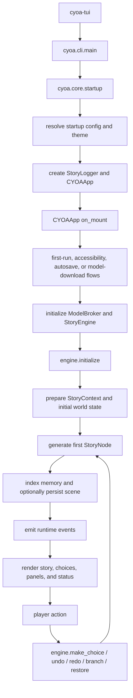

# CYOA TUI CodeWiki

This document describes the repository as it exists on 2026-07-11. It is a fast technical map for contributors, reviewers, and anyone trying to understand the current architecture without reading the entire codebase first.

## 1. Project Snapshot

- App type: terminal-first interactive fiction built with `Textual`
- Python: `>=3.13`
- Packaged command: `cyoa-tui`, defined in [`pyproject.toml`](pyproject.toml)
- Authoritative startup entrypoint: [`cyoa/cli.py`](cyoa/cli.py)
- Main package: [`cyoa/`](cyoa/)
- Built-in providers:
  - `mock` for demos, tests, and safe startup
  - `llama_cpp` for local GGUF inference
- Optional extras:
  - `local-llm` for `llama-cpp-python` and guided model download support
  - `memory` for Chroma-backed retrieval
  - `observability` for OpenTelemetry export
  - `packaging` for PyInstaller builds

## 2. What The App Currently Does

The current codebase supports:

- first-run setup with `Quick Demo` or guided local model download
- strict startup validation for provider, preset, theme, and numeric env settings
- startup accessibility overrides from CLI and saved accessibility presets
- terminal accessibility fallback and startup recommendations
- streaming narrative turns with typewriter controls
- branching choices with keyboard-first navigation
- choice requirements based on inventory, stats, flags, companions, and in-world time
- optional risky choice checks that resolve with a roll and persist the result
- save/load, autosave recovery, undo/redo, bookmarks, and branch-from-history flows
- exports as Markdown, accessible plain text, and machine-readable timeline JSON
- journal, story map, inventory inspector, scene recap, character sheet, lore codex, notification history, run archive, endings discovered, and hidden achievements screens
- editable directives, runtime preset selection, generation preset cycling, and remappable keybindings
- built-in SQLite story persistence plus optional RAG and telemetry integrations

## 3. Repository Map

### Startup and packaging

- [`pyproject.toml`](pyproject.toml)
  - defines the `cyoa-tui` console script
  - declares optional extras and dev tooling
- [`cyoa/cli.py`](cyoa/cli.py)
  - loads `.env` before other imports that read environment variables
  - parses CLI flags
  - delegates startup validation to [`cyoa/core/startup.py`](cyoa/core/startup.py)
  - persists resolved user config
  - loads theme content or a direct prompt override
  - creates [`StoryLogger`](cyoa/db/story_logger.py)
  - starts [`CYOAApp`](cyoa/ui/app.py)
- [`cyoa/core/startup.py`](cyoa/core/startup.py)
  - validates provider, runtime preset, generation preset, model path, and numeric environment settings
  - resolves safe default provider behavior from CLI, environment, saved config, and runtime presets
- [`scripts/build_binary.py`](scripts/build_binary.py)
  - builds the PyInstaller bundle from [`cyoa/cli.py`](cyoa/cli.py)
  - includes theme, resource, prompt-template, Textual, and stylesheet assets

### Core runtime

- [`cyoa/core/constants.py`](cyoa/core/constants.py): defaults, user data paths, startup prompt, UI constants
- [`cyoa/core/models.py`](cyoa/core/models.py): Pydantic contracts for choices, story nodes, objectives, lore, companions, and world time
- [`cyoa/core/state.py`](cyoa/core/state.py): long-lived game state, snapshots, bookmarks, save serialization, and event emission
- [`cyoa/core/mementos.py`](cyoa/core/mementos.py): typed undo/redo and restore payloads
- [`cyoa/core/engine.py`](cyoa/core/engine.py): main orchestration layer for generation, branching, persistence, and runtime phases
- [`cyoa/core/runtime.py`](cyoa/core/runtime.py): `EnginePhase` and `EngineTransition`
- [`cyoa/core/events.py`](cyoa/core/events.py): global event bus and event name contract
- [`cyoa/core/rag.py`](cyoa/core/rag.py): retrieval coordinator over narrative and NPC memory stores
- [`cyoa/core/user_config.py`](cyoa/core/user_config.py): saved preferences, accessibility presets, startup recommendations
- [`cyoa/core/theme_loader.py`](cyoa/core/theme_loader.py): theme discovery, validation, and contrast checks
- [`cyoa/core/model_download.py`](cyoa/core/model_download.py): guided GGUF recommendation and download
- [`cyoa/core/preflight.py`](cyoa/core/preflight.py): terminal and local-model preflight checks
- [`cyoa/core/observability.py`](cyoa/core/observability.py): OpenTelemetry setup and no-op fallback runtime
- [`cyoa/core/support.py`](cyoa/core/support.py): private file handling, crash logs, support paths, file-manager reveal helper
- [`cyoa/core/ports.py`](cyoa/core/ports.py): protocols for story repositories and memory stores

### LLM layer

- [`cyoa/llm/broker.py`](cyoa/llm/broker.py)
  - owns `StoryContext`
  - manages generation presets
  - supports unified generation or the two-step narrator-plus-extraction path
  - performs schema repair retries
  - maintains speculative cache entries and provider state restore
  - runs background summarization when context pressure rises
- [`cyoa/llm/providers.py`](cyoa/llm/providers.py)
  - provider abstraction
  - `MockProvider`
  - `LlamaCppProvider`
  - token counting, JSON streaming, and provider state transfer hooks
- [`cyoa/llm/pipeline.py`](cyoa/llm/pipeline.py): modular prompt assembly pipeline
- [`cyoa/llm/templates/system_prompt.j2`](cyoa/llm/templates/system_prompt.j2): base system prompt template

### Persistence and optional services

- [`cyoa/db/story_logger.py`](cyoa/db/story_logger.py): event-driven `story.md` transcript writer
- [`cyoa/db/sqlite_db.py`](cyoa/db/sqlite_db.py): required local story repository, schema initialization, history, and story-tree reconstruction
- [`cyoa/db/rag_memory.py`](cyoa/db/rag_memory.py): optional in-process Chroma-backed narrative and NPC memory stores with fallback behavior

### UI layer

- [`cyoa/ui/app.py`](cyoa/ui/app.py): Textual app, startup flow, model download flow, settings application, notifications, engine bootstrapping
- [`cyoa/ui/components.py`](cyoa/ui/components.py): workspace widgets, modals, settings UI, first-run screens, palette UI
- [`cyoa/ui/keybindings.py`](cyoa/ui/keybindings.py): binding specs, palette entries, keybinding override resolution
- [`cyoa/ui/presenters.py`](cyoa/ui/presenters.py): rendering helpers for recaps, codex summaries, exports, status text, achievements, archive views
- [`cyoa/ui/commands.py`](cyoa/ui/commands.py): command objects for persistence-oriented UI actions
- [`cyoa/ui/ascii_art.py`](cyoa/ui/ascii_art.py): narrative scene-art lookup
- [`cyoa/ui/styles.tcss`](cyoa/ui/styles.tcss): app styling
- [`cyoa/ui/mixins/`](cyoa/ui/mixins)
  - `events.py`: event subscriptions and runtime reaction
  - `navigation.py`: user actions, panels, help, archive, bookmarks, branching
  - `persistence.py`: save/load, autosave, export, restore, archive writes
  - `rendering.py`: story rendering and panel refresh logic
  - `theme.py`: theme and appearance application
  - `typewriter.py`: streaming reveal behavior

### Assets, scripts, and docs

- [`cyoa/themes/`](cyoa/themes): shipped narrative themes and palette definitions
- [`monitoring/`](monitoring): OTEL collector, Prometheus, and Grafana config
- [`docker-compose.yml`](docker-compose.yml): local stack for monitoring
- [`scripts/`](scripts)
  - `run_smoke.sh`
  - `check_coverage.py`
  - `validate_themes.py`
  - `build_binary.py`
  - `install_git_hooks.sh`
- [`docs/`](docs): consumer and setup documentation

## 4. Startup Flow

The packaged startup path is:

```text
cyoa-tui -> cyoa.cli:main
```

Startup validation is split between [`cyoa/cli.py`](cyoa/cli.py) and [`cyoa/core/startup.py`](cyoa/core/startup.py), with `cyoa.cli.main` as the only runtime entrypoint. Current startup behavior is easy to verify from code:

1. `.env` is loaded immediately.
2. Observability setup is initialized before app launch.
3. User-facing directories are created.
4. CLI arguments are parsed.
5. Startup config is resolved by `validate_startup_config` from CLI, environment, runtime presets, and saved config.
6. Invalid providers, presets, themes, or numeric env values fail fast with exit code `2`.
7. Resolved provider, model path, theme, preset, and runtime preset are saved back to user config.
8. Theme data is loaded unless `--prompt` overrides it directly.
9. `StoryLogger` subscribes to engine events.
10. `CYOAApp` is created and run.

PyInstaller packaging follows the same path. [`scripts/build_binary.py`](scripts/build_binary.py) passes [`cyoa/cli.py`](cyoa/cli.py) as the PyInstaller entry script, and release smoke checks execute the packaged `cyoa-tui --help`.

Current CLI flags in [`cyoa/cli.py`](cyoa/cli.py):

- `--model`
- `--theme`
- `--prompt`
- `--preset`
- `--runtime-preset`
- `--screen-reader`
- `--high-contrast`
- `--reduced-motion`

Current runtime presets:

- `local-quality`: `llama_cpp` + `precise`
- `local-fast`: `llama_cpp` + `balanced`
- `mock-smoke`: `mock` + `precise`

The safe default-provider rule is important:

- if a valid local model path is available, startup prefers `llama_cpp`
- otherwise startup falls back to `mock`

## 5. UI Startup Behavior

The UI is no longer a thin wrapper around the engine. It owns a substantial amount of product behavior.

Key startup responsibilities inside [`cyoa/ui/app.py`](cyoa/ui/app.py):

- loading saved UI preferences and keybinding overrides
- applying accessibility preferences and terminal fallbacks
- showing the first-run setup screen when required
- offering startup accessibility recommendations when appropriate
- checking for autosave recovery
- presenting guided model download with preflight notes and blocking reasons
- bootstrapping `ModelBroker`, `StoryEngine`, local SQLite persistence, and optional RAG
- warming optional runtime services only after the first scene is visible

Current first-run entry options exposed by the UI:

- `Quick Demo`
- `Download Local Model`

## 6. Runtime Architecture

### Engine

[`StoryEngine`](cyoa/core/engine.py) is the central coordinator. It currently:

- maintains the current `GameState`
- owns `StoryContext` and speculative cache state
- tracks explicit lifecycle phases with `EnginePhase`
- initializes fresh adventures and restarts existing ones
- processes choices, including optional risky choice checks
- retrieves memories before generation
- triggers background summarization when context size crosses a threshold
- restores saves, bookmarks, undo/redo snapshots, and branch-to-history state
- persists nodes and choice edges to local SQLite
- indexes scenes into narrative and NPC memory stores
- shuts down background tasks and external services cleanly

### Story context and prompts

[`StoryContext`](cyoa/llm/broker.py) now carries more than just raw history. It tracks:

- the starting prompt
- rolling message history
- current inventory and player stats
- injected memory snippets and structured memory metadata
- hierarchical summaries
- goals and directives
- objectives, factions, NPC affinity, flags, lore entries, companions, and world time

Prompt assembly is component-based in [`cyoa/llm/pipeline.py`](cyoa/llm/pipeline.py), not a single hardcoded string builder.

### Generation path

[`ModelBroker`](cyoa/llm/broker.py) currently supports two generation patterns:

- unified mode: one model call produces the full `StoryNode`
- judge pattern: one call produces `NarratorNode`, then a second call extracts structured state deltas into `ExtractionNode`

The broker also manages:

- generation presets: `balanced`, `precise`, `cinematic`
- runtime temperature and token limits
- JSON repair attempts
- background summarization
- provider state save/restore for speculation

Older rolling-summary compatibility helpers are no longer part of the broker API. Current summarization state is hierarchical on `StoryContext` (`scene_summary`, `chapter_summary`, and `arc_summary`) and is updated through `set_hierarchical_summary`.

### Optional memory

[`RAGManager`](cyoa/core/rag.py) separates:

- recent scene continuity memory
- semantic chapter memory
- NPC-specific memory

It injects these memories into `StoryContext` and rebuilds memory stores after branch or restore flows when needed.

### Local story persistence

[`CYOASQLiteDB`](cyoa/db/sqlite_db.py) provides:

- story title creation and collision handling
- scene persistence
- scene history path lookup
- story tree reconstruction for the map/archive surfaces
- automatic schema initialization

## 7. Runtime Flow


```mermaid
flowchart TD
    A[cyoa-tui] --> B[cyoa.cli.main]
    B --> C[cyoa.core.startup]
    C --> D[resolve startup config and theme]
    D --> E[create StoryLogger and CYOAApp]
    E --> F[CYOAApp on_mount]
    F --> G[first-run, accessibility, autosave, or model-download flows]
    G --> H[initialize ModelBroker and StoryEngine]
    H --> I[engine.initialize]
    I --> J[prepare StoryContext and initial world state]
    J --> K[generate first StoryNode]
    K --> L[index memory and optionally persist scene]
    L --> M[emit runtime events]
    M --> N[render story, choices, panels, and status]
    N --> O[player action]
    O --> P[engine.make_choice / undo / redo / branch / restore]
    P --> K
```

## 8. Core Data Contracts

### `StoryNode`

[`StoryNode`](cyoa/core/models.py) is richer than in earlier versions. Important fields now include:

- `narrative`
- `title`
- `items_gained`
- `items_lost`
- `npcs_present`
- `stat_updates`
- `choices`
- `is_ending`
- `mood`
- `objectives_updated`
- `faction_updates`
- `npc_affinity_updates`
- `story_flags_set`
- `story_flags_cleared`
- `lore_entries_updated`
- `companions_updated`
- `time_advance_hours`

Validation rule:

- non-ending nodes must contain `2` to `4` choices

### `Choice`

Choices can now include:

- `requirements`
- `check`

Requirement checks support:

- inventory items
- minimum stats
- required flags
- companion roster state
- companion affinity thresholds
- minimum or maximum day
- allowed time-of-day periods

### `GameState`

[`GameState`](cyoa/core/state.py) tracks:

- current node and story title
- inventory and player stats
- turn count
- current scene id
- last submitted choice text
- last resolved choice check
- timeline metadata
- objectives
- faction reputation
- NPC affinity
- story flags
- lore entries
- companions
- world time
- undo and redo history
- named bookmarks

Default stats are still:

- `health: 100`
- `gold: 0`
- `reputation: 0`

### `StoryContext`

`StoryContext` is the engine-facing prompt state. It should be considered the source of truth for what the LLM sees, while `GameState` is the source of truth for what the player has and what the UI renders.

### Engine lifecycle

[`cyoa/core/runtime.py`](cyoa/core/runtime.py) defines these phases:

- `idle`
- `initializing`
- `generating`
- `ready`
- `restoring`
- `error`
- `shutdown`

## 9. Event Contract

The global event bus in [`cyoa/core/events.py`](cyoa/core/events.py) still drives cross-module coordination.

Current high-signal events:

- lifecycle:
  - `engine.started`
  - `engine.restarted`
  - `engine.phase_changed`
- narrative flow:
  - `engine.choice_made`
  - `engine.node_generating`
  - `engine.token_streamed`
  - `engine.summarization_started`
  - `engine.node_completed`
- state:
  - `engine.stats_updated`
  - `engine.inventory_updated`
  - `engine.world_state_updated`
  - `engine.story_title_generated`
- outcomes:
  - `engine.ending_reached`
  - `engine.error_occurred`
  - `engine.status_message`
- integrations:
  - `db.saved`
  - `memory.indexed`

`StoryLogger` is one concrete subscriber. The UI layer is another major subscriber.

## 10. Configuration Surface

### CLI

See [`cyoa/cli.py`](cyoa/cli.py) for the authoritative parser.

### Environment variables

The most important current env surface is:

- provider and model:
  - `LLM_PROVIDER`
  - `LLM_MODEL_PATH`
  - `LLM_MODEL`
- generation:
  - `LLM_PRESET`
  - `LLM_UNIFIED_MODE`
  - `LLM_N_CTX`
  - `LLM_TEMPERATURE`
  - `LLM_MAX_TOKENS`
  - `LLM_TOKEN_BUDGET`
  - `LLM_SUMMARY_THRESHOLD`
  - `LLM_SUMMARY_MAX_TOKENS`
  - `LLM_REPAIR_ATTEMPTS`
- runtime presets:
  - `APP_RUNTIME_PRESET`
- optional integrations:
  - `CYOA_ENABLE_OBSERVABILITY`
- diagnostics:
  - `CYOA_ENABLE_RAG`
- observability:
  - `OTEL_EXPORTER_OTLP_ENDPOINT`
- filesystem overrides:
  - `CYOA_CONFIG_DIR`
  - `CYOA_DATA_DIR`
  - `CYOA_STATE_DIR`

### Saved user config

[`cyoa/core/user_config.py`](cyoa/core/user_config.py) persists:

- provider and model path
- theme and runtime preset
- accessibility preset and direct accessibility toggles
- typography and reading width preferences
- notification, recap, and metadata verbosity
- typewriter settings
- diagnostics mode
- keybinding overrides
- first-run completion state
- dismissed startup recommendations

## 11. Persistence and Local Files

Current user-facing storage is platform-aware and defined in [`cyoa/core/constants.py`](cyoa/core/constants.py).

Important files and directories include:

- `config.json`: durable user preferences
- `saves/`: manual saves and autosave payloads
- `saves/exports/`: exported Markdown, accessible text, and timeline JSON
- `saves/run_archive.json`: archive metadata
- `models/`: downloaded GGUF files
- `stories.sqlite3`: local story scenes and choice edges
- `story.md`: append-only story transcript maintained by `StoryLogger`
- `last_crash.log`: structured crash report written on unexpected startup failure

File writes use owner-only permissions where supported via [`open_private_text_file`](cyoa/core/support.py).

Save and autosave restore flows hydrate through [`cyoa/ui/mixins/persistence.py`](cyoa/ui/mixins/persistence.py). Before restoring, `_validate_save_payload` requires the engine payload fields (`starting_prompt`, `context_history`, `prompt_config`, `turn_count`, `inventory`, `player_stats`, `current_node`, `saved_at`) and the UI payload fields (`current_story_text`, `story_segments`, `journal_entries`, `current_turn_text`, `active_turn`, `mood`, panel collapse flags). Malformed restore points are rejected before hydration.

## 12. Optional Integrations and Degraded Mode

The current architecture is intentionally resilient when optional services are missing.

### RAG memory

- backed by in-process Chroma when the `memory` extra is installed
- narrative and NPC memory are separate stores
- recent-history fallback still works when Chroma is unavailable
- the app can surface a warning while continuing play when RAG diagnostics are enabled

### Observability

- OpenTelemetry is optional
- the code ships with a no-op fallback runtime when the extra is absent
- OTLP export only activates when `CYOA_ENABLE_OBSERVABILITY` is set
- unreachable collectors log warnings instead of aborting the app

## 13. Theme System

Themes are more than prompt skins.

Each theme in [`cyoa/themes/`](cyoa/themes):

- provides a narrative prompt
- provides spinner frames and accent color
- supplies a validated UI palette
- can seed opening inventory, stats, objectives, companions, reputations, affinity, and flags
- can seed prompt goals, directives, and persona

[`cyoa/core/theme_loader.py`](cyoa/core/theme_loader.py) performs structural validation and accessibility-oriented contrast checks for muted and locked surfaces.

## 14. Tests and Tooling

This repo has broad test coverage across startup, engine, UI, persistence, packaging, themes, and optional integrations. High-signal modules include:

- [`tests/test_main.py`](tests/test_main.py): startup validation and `cyoa.cli.main` behavior
- [`tests/test_tui.py`](tests/test_tui.py): integrated Textual behavior
- [`tests/test_ui_units.py`](tests/test_ui_units.py): presenter, export, and UI helper logic
- [`tests/test_engine_state.py`](tests/test_engine_state.py): engine state and restore flows
- [`tests/test_story.py`](tests/test_story.py): story generation and memory behaviors
- [`tests/test_llm_providers.py`](tests/test_llm_providers.py): provider-specific behavior
- [`tests/test_db_integration.py`](tests/test_db_integration.py): graph repository behavior
- [`tests/test_model_download.py`](tests/test_model_download.py): recommendation and download flow
- [`tests/test_themes.py`](tests/test_themes.py): theme validation
- [`tests/test_observability.py`](tests/test_observability.py): OTEL behavior and fallbacks
- [`tests/test_packaging.py`](tests/test_packaging.py): packaged/runtime expectations

Common developer commands:

```bash
uv sync --group dev
uv run pytest -q
bash scripts/run_smoke.sh
uv run python scripts/check_coverage.py
uv run python scripts/validate_themes.py
uv run ruff check .
uv run mypy cyoa
uv run python scripts/build_binary.py
```

## 15. Extension Notes

### Add a theme

1. Add `themes/<name>.toml`.
2. Include prompt, spinner frames, accent color, and required `ui` palette fields.
3. Add opening world-state or directive fields only if the theme needs them.
4. Run `uv run python scripts/validate_themes.py`.
5. Run `uv run pytest -q tests/test_themes.py`.

### Add a provider

1. Implement `LLMProvider` in [`cyoa/llm/providers.py`](cyoa/llm/providers.py).
2. Wire provider construction into `ModelBroker._create_provider_from_env`.
3. Decide whether it supports streaming JSON and provider state transfer.
4. Add or update tests in [`tests/test_llm_providers.py`](tests/test_llm_providers.py).

### Add a new piece of world state

1. Extend the relevant Pydantic model in [`cyoa/core/models.py`](cyoa/core/models.py).
2. Persist it in [`cyoa/core/state.py`](cyoa/core/state.py) and [`cyoa/core/mementos.py`](cyoa/core/mementos.py).
3. Sync it through `StoryContext` in [`cyoa/llm/broker.py`](cyoa/llm/broker.py).
4. Surface it in presenters or UI panels if it is player-visible.
5. Cover save/load, undo/redo, and export behavior in tests.

### Add a new event

1. Define the event name in [`cyoa/core/events.py`](cyoa/core/events.py).
2. Emit it from the engine, state, broker, or UI layer.
3. Subscribe from the relevant consumer.
4. Add regression tests if the event changes user-visible behavior.

## 16. Current Architectural Takeaways

The current codebase is best understood as four cooperating layers:

- startup and settings resolution in `cyoa/cli.py` and `cyoa/core`
- narrative orchestration in `StoryEngine` and `ModelBroker`
- optional persistence and retrieval services in `cyoa/db`
- a fairly feature-rich Textual product shell in `cyoa/ui`

The most important change from older versions of this repo is that the app now treats startup safety, accessibility, restore flows, and optional-service degradation as first-class features rather than afterthoughts.
