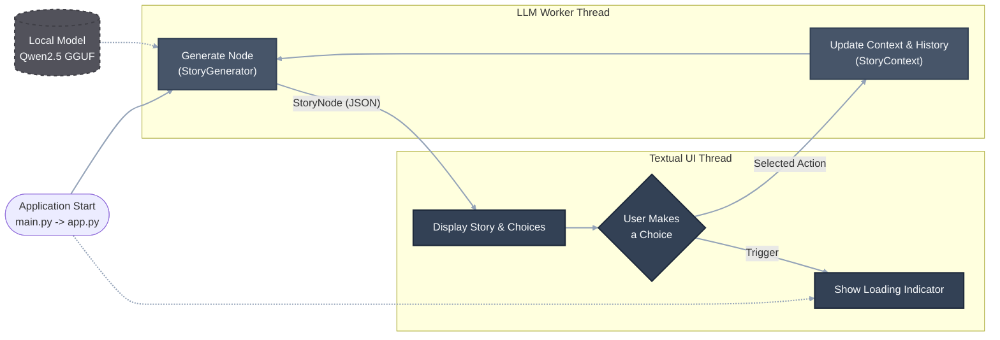

# CYOA TUI Architecture

```mermaid
%%{init: {'flowchart': {'curve': 'basis'}}}%%
flowchart LR
    %% Define Styles (Muted, Sophisticated Palette)
    classDef tui fill:#334155,color:#F8FAFC,stroke:#1E293B,stroke-width:2px;
    classDef backend fill:#475569,color:#F8FAFC,stroke:#334155,stroke-width:2px;
    classDef model fill:#52525B,color:#F8FAFC,stroke:#3F3F46,stroke-width:2px,stroke-dasharray: 5 5;
    
    %% Lines
    linkStyle default stroke:#94A3B8,stroke-width:2px;

    %% Nodes
    Start([Application Start<br/>main.py -> app.py])

    subgraph TUI["Textual UI Thread"]
        direction TB
        ShowLoading["Show Loading Indicator"]:::tui
        DisplayStory["Display Story & Choices"]:::tui
        UserChoice{"User Makes<br/>a Choice"}:::tui
    end

    subgraph Backend["LLM Worker Thread"]
        direction TB
        Generate["Generate Node<br/>(StoryGenerator)"]:::backend
        UpdateContext["Update Context & History<br/>(StoryContext)"]:::backend
    end

    SubModel[("Local Model<br/>Qwen2.5 GGUF")]:::model

    %% Edges
    Start --> Generate
    Start -.-> ShowLoading
    
    SubModel -.-> Generate

    Generate -- "StoryNode (JSON)" --> DisplayStory
    DisplayStory --> UserChoice
    
    UserChoice -- "Selected Action" --> UpdateContext
    UserChoice -- "Trigger" --> ShowLoading
    
    UpdateContext --> Generate
```
